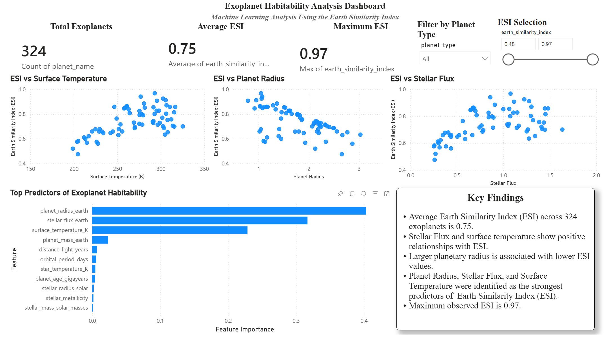

# Exoplanet Habitability Prediction Using Machine Learning

## Project Overview

This project explores the relationship between planetary and stellar characteristics alongside exoplanet habitability as measured by the Earth Similarity Index (ESI). Exploratory Data Analysis, feature selection, and machine learning models were utilized to identify the most important characteristics associated with habitability and predict ESI values.

### Dashboard Highlights
- Interactive Planet Type filter
- ESI range selection slider
- KPI cards: Total Planets, Average ESI, Maximum ESI
- Scatterplots display relationships between ESI and top Features
- Random Forest Feature Importance Analysis
- Key Findings

### Dashboard Access

The interactive Power BI report was originally hosted through a WGU workspace and is no longer publicly accessible. The complete dashboard '.pbix' file is included in this repository to access in Microsoft Power BI.

## Research Problem

As the number of discovered exoplanets grow, researches need efficient methods to identify potentially habitable planets and perhaps discover life on other worlds. This project examines which planetary and stellar features contribute most to Earth-like conditions and develops predictive machine learning models to predict ESI.

## Datasets

Datasets used: Planetary Systems, Habitable Worlds Catalog

Key Features:
- Planet Radius
- Planet Mass
- Surface Temperature
- Stellar Flux
- Stellar Radius
- Stellar Mass
- Stellar Metallicity
- Orbital Period
- Distance from Earth
- Earth Similarity Index (ESI)-target variable

## Exploratory Data Analysis

- Data Cleaning and Preparation
- Univariate Analysis
- Bi-variate Analysis
- Correlation Analysis
- Feature Importance Analysis

## Machine Learning Models

### Linear Regression

Linear Regression was used as a baseline model for prediction performance.

**Results**
- Test R Squared: 0.75319
- Train R Squared: 0.80561
- MAE: 0.03304
- RMSE: 0.04485

### Random Forest Regressor

Random Forest Regressor was used to evaluate nonlinear relationships between the predictor variables and ESI.

**Results**
- Test R Squared: 0.98592
- Train R Squared: 0.99434
- MAE: 0.00385
- RMSE: 0.01071

## Key Findings

Feature importance analysis identified the following characteristics as predictors of the Earth Similarity Index (ESI):

1. Planet Radius
2. Stellar Flux
3. Surface Temperature

## Technologies Used

- Python
- Pandas
- Numpy
- Matplotlib
- Seaborn
- Scikit-Learn
- Jupyter Notebook

## Future Improvements

- Develop additional machine learning models
- Incorporate larger stellar and exoplanet datasets
- Include more available characteristics, such as atmospheric characteristics
- Deploy model as a web application

## Author

Joshua Reisinger

Aspiring Data Engineer and Data Scientist | Machine Learning and Data Analytics